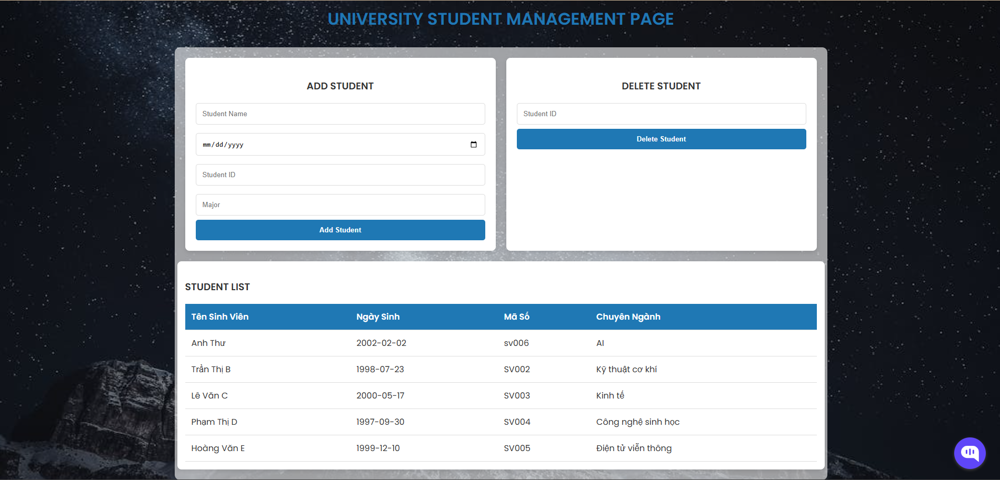
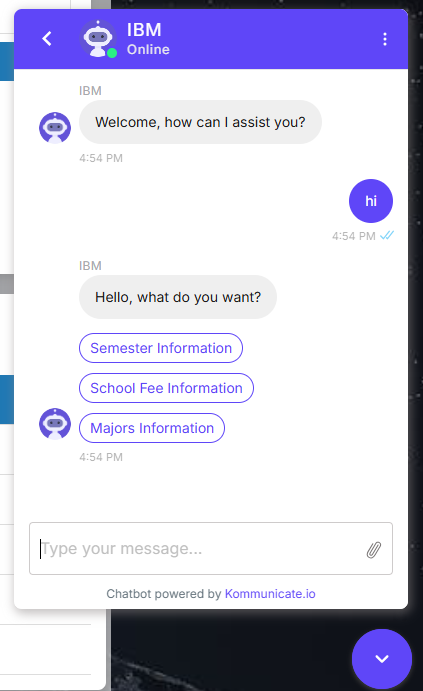

# student-management-web-integrated-chatbot
 
## Colab Note Book
- Create Database in IBM Cloud
- Create a chatbot in kmomunication and paste AppID into index.html
- Copy keys such as host, uid, password, host and paste into code block.
- Run all code blocks and click the link below this code block:
  ```
  from google.colab.output import eval_js
  print(eval_js('google.colab.kernel.proxyPort(5000)'))
  ```

## Run on Terminal
- Create Database in IBM Cloud
- Create a chatbot in kmomunication and paste AppID into index.html
- Copy keys such as host, uid, password, host and paste into code block.
- Run:
  ```python app.py ```

# Web OverView


